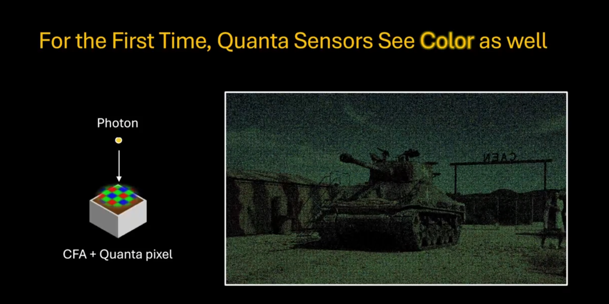
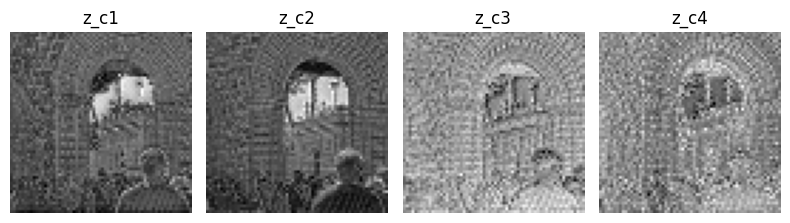
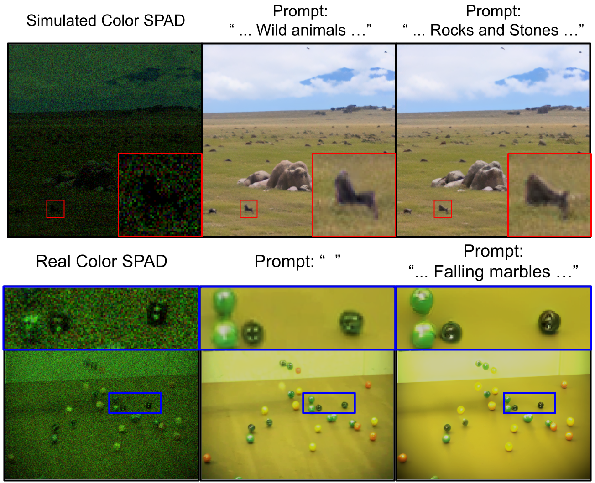

# [CVPR 2026] gQIR: Generative Quanta Image Reconstruction

<!-- TODO: Teaser Image/Video -->



[](https://arxiv.org/abs/2602.20417) [](https://huggingface.co/spaces/AryanGarg/TODO) 

[Aryan Garg](https://aryan-garg.github.io/)<sup>1</sup>, [Sizhuo Ma](https://sizhuoma.netlify.app/)<sup>2</sup>, [Mohit Gupta](https://wisionlab.com/people/mohit-gupta/)<sup>1</sup>,

<sup>1</sup> University of Wisconsin-Madison<br><sup>2</sup> Snap, Inc<br>


## Table of Contents

- [Installation](#installation)
- [Quick Start](#quick_start)
- [Pretrained Models and Dataset](#pretrained_models_and_dataset)
- [Inference](#inference)
- [Training](#training)
- [Citation](#citation)
- [Acknowledgements](#acknowledgements)
- [Contact](#contact)
- [FAQs](#faqs)


## <a id="installation"></a>Installation

Recommended Hardware: NVIDIA RTX 4090 (CUDA version: 12.5)

```bash
conda env create -f environment.yml
```

#### RAFT setup:
```bash
sh download_raft_weights.sh
```

Make sure `./pretrained_ckpts/models/raft-things.pth` is a valid path & properly downloaded RAFT weight. (This is used in all burst pipelines. See L257 of infer_burst.py)


## <a id="quick_start"></a>Quick Start

**Launching the local gradio demo:** 
TODO

## <a id="pretrained_models_and_dataset"></a>Pretrained Models and Dataset

### Model Zoo:
TODO

### XD-Dataset:
TODO

### Datasets used:
TODO

## <a id="inference"></a>Inference 

### Stage 1 & 2 - Single Image Reconstruction:

For Stage 1, simply add the `--only_vae` flag at the end of any of the shown below example commands.

#### Example for Single Image with GT:
```bash
python3 infer_sd2GAN_stage2.py --config configs/inference/eval_3bit_color.yaml --eval_single_image --single_img_path "<path-to-dataset>/DIV2K_valid_HR/0829.png"
```

#### Example for running directly on a GT Dir:
```bash
python3 infer_sd2GAN_stage2.py --config configs/inference/eval_3bit_mono.yaml --eval_gt_dir --gt_dir <path-to-gt-dir> 
```

#### For real world captures:
```bash
python3 infer_sd2GAN_stage2.py --config configs/inference/eval_3bit_color.yaml --ds_txt ds_txt_real_captures.txt --real_captures
```

### Stage 3 - Burst Reconstruction:
TODO


## <a id="training"></a>Training
<!-- DONE -->

#### Stage 1 - Training SPAD-CMOS Aligned VAE:

```bash
conda activate hypir   
```

1-bit qVAE:
```bash
CUDA_VISIBLE_DEVICES=8,9,10,11,12,13,14,15 accelerate launch --main_process_port 29502 train_s1_mosaic.py --config configs/train/train_s1_mosaic_1bit.yaml
```

3-bit qVAE:
```bash
CUDA_VISIBLE_DEVICES=0,1,2,3,4,5,6,7 accelerate launch --main_process_port 29503 train_s1_mosaic.py --config configs/train/train_s1_mosaic_3bit.yaml
```

#### Stage 2 - Latent Space Enhancement - Adversarial Training with Diffusion Initialization:

```bash
python3 train_sd2GAN.py --config configs/train/train_sd2gan.yaml   
```   

#### Stage 3 - Burst Processing - Fidelity Upgrade

<!--  -->
<!-- Key insight: Second channel of the encoded latents have the most semantic information which enables flow warping to the center channel for burst refinement. However 4x upscaling is still required to compute flow. -->

For comparison with QUIVER & QBP:  
```bash
CUDA_VISIBLE_DEVICES=1 python3 train_burst.py --config configs/train/train_burst.yaml  
```

For color-burst model:
```bash
CUDA_VISIBLE_DEVICES=1 python3 train_burst.py --config configs/train/train_burst_mosaic.yaml 
```

**Precomputing latents:**

```bash
conda activate hypir && cd apgi/gQVR   

python3 infer_sd2GAN_stage2.py --config configs/inference/eval_sd2GAN.yaml --device "cuda:0" --ds_txt dataset_txt_files/video_dataset_txt_files/combined_part00.txt
```
<!-- 
**1. Training Latent Space 3D Stabilizer:**

```bash
conda activate hypir && cd apgi/gQVR   

accelerate launch train_3Dtemp_stabilization.py --config configs/train/train_sd2gan_video.yaml
```

**2. Training ConvEMA Decoder:**

```bash
conda activate hypir && cd apgi/gQVR    

accelerate launch train_convEMADecoder.py --config configs/train/train_convEMA_decoder_stage3.yaml
``` -->

---


## <a id="Cite"></a>Citation
Please cite our work if you find it useful. Thanks! :)

```bibtex
@InProceedings{garg_2026_gqir,
    author    = {Garg, Aryan and Ma, Sizhuo and  Gupta, Mohit},
    title     = {gQIR: Generative Quanta Image Reconstruction},
    booktitle = {Proceedings of the IEEE/CVF Conference on Computer Vision and Pattern Recognition (CVPR)},
    month     = {June},
    year      = {2026},
}
```

## <a id="acknowledgements"></a>Acknowledgements
This project is based on [XPixelGroup](https://xpixel.group/)'s projects: [DiffBIR](https://github.com/XPixelGroup/DiffBIR) and [HYPIR](https://github.com/XPixelGroup/HYPIR). Thanks for their amazing work.

Additionally, the entire project was supported by [Ubicept](https://www.ubicept.com) for compute (cloud credits).

## <a name="contact"></a>Contact

If you have any questions, please feel free to contact me at [agarg54@wisc.edu](mailto:agarg54@wisc.edu) or raise an issue here.


## <a id="FAQs"></a>FAQs

1. What is the minmum average PPP where gQIR works?

> 1PPP average was tested. It might work below that limit as well. Contrast correction is needed. Note: Training PPP was fixed at 3.25PPP (alpha = 1.0).

2. Can I increase the input size/temporal window for Stage 3?

> Due to VRAM limitations we could only train with 11 3-bit block sums. With more VRAM, scaling is possible. A smarter block-summing strategy could potentially provide gains.

3. Can you quantify or control hallucination?

> gQIR has no such mechanism as of yet.

4. Can I use prompts to guide the reconstruction since the base prior is a T2I model (SD2.1)?

> Absolutely yes! 


